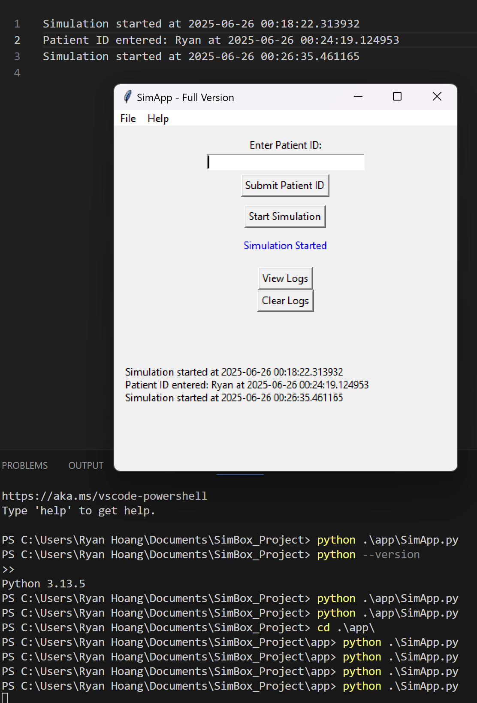

# SimBox Project

SimBox is a simulated field service engineering environment for configuring, testing, and maintaining a Windows 10-based medical simulator. It’s designed to reflect real-world tasks performed by entry-level Field Service Engineers, especially in healthcare or training environments.

---

## 🔧 What's Included

- ✅ GUI-based simulation app using Python (`SimApp.py`)
- ✅ PowerShell script to automate device setup (`configure_device.ps1`)
- ✅ Batch script to install the mock simulator (`install_mock_app.bat`)
- ✅ Manual TCP/IP network configuration and connectivity tests
- ✅ Maintenance checklist PDF for field readiness
- ✅ Troubleshooting guide PDF for common field issues

---

## 💡 Purpose

This project was created to demonstrate hands-on ability in:

- System setup and configuration (hostname, time zone, RDP)
- Basic networking (TCP/IP, DHCP)
- Windows 10 support and log management
- Simulated installation and diagnostics
- Documentation and end-user support

---

## 🔧 Features

- Python GUI using tkinter (no external libraries required)
- Local `simapp_log.txt` automatically updated with user actions
- Real-time feedback through the GUI

---

## 📋 Skills Demonstrated

- Windows desktop scripting (Python, tkinter)
- Logging and file I/O
- GUI layout and event handling
- End-user support simulation
- Menu creation and multi-window logic

---

## 🚀 How to Run

git clone https://github.com/ryan-02/SimBox_Project.git
cd SimBox_Project
python SimApp.py

---

## 🖼 Screenshots

### DEMO

---

## 💼 Ideal For

- Field Service Engineer roles
- IT Support Technician interviews
- Entry-level Desktop Support portfolios
- Anyone learning hands-on technical support skills

---

## 🔗 Author

**Ryan Hoang**  
Computer Engineering | IT + Cybersecurity Support  
[ryanhoangbusi@gmail.com](mailto:ryanhoangbusi@gmail.com)

